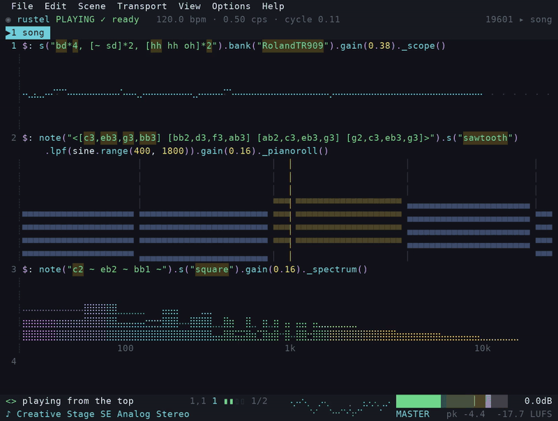

<div align="center">

<picture>
  <source media="(prefers-color-scheme: dark)" srcset="docs/assets/logo-dark.svg">
  
</picture>

### Live-code music in your terminal.

A native engine for the [Strudel](https://strudel.cc) pattern language.
One small binary. No browser. No server.

[](LICENSE)
[](rustelup/README.md)
[](docs/building.md)

[Website](https://rustel.cc) ·
[Install](rustelup/README.md) ·
[Studio guide](docs/studio.md) ·
[CLI guide](docs/cli.md) ·
[Compatibility](docs/compatibility.md) ·
[Support](#support-rustel)



</div>

Rustel is a native port of [Strudel](https://strudel.cc), written in Rust
for Linux, macOS, and Windows. It supports command-line use, live coding
in your preferred editor, and a studio that runs in a terminal.

Play synths and samples, control MIDI/OSC devices, add live visuals, and
export audio. No browser is required.

## What you get

| | |
| --- | --- |
| **Strudel patterns** | Patterns, samples, synths, and effects from the Strudel language. See [compatibility](docs/compatibility.md) for the exceptions. |
| **Studio** | A terminal editor with live update, visuals, a mixer, and a key reference. A bad update leaves the last good score playing. |
| **Your editor** | Run `rustel song.strudel --watch` and edit in any editor. Audio keeps running across saves. |
| **Session tapes** | Studio logs each installed update with its time. See [sessions](docs/sessions.md). |
| **Hardware** | Speakers, audio input, MIDI, OSC, and serial. MIDI clock can follow or lead. See [hardware](docs/hardware.md). |
| **Visuals** | Scope, piano roll, spectrum, and [Hydra](docs/hydra.md) in the terminal. |
| **Offline render** | Export to WAV or MP3 with repeatable output. |

## Quick start

[Install Rustel](rustelup/README.md), then open Studio:

```sh
rustel studio
```

Try this pattern. It uses a built-in synth and needs no samples:

```js
note("c4 e4 g4").s("sine").gain(0.2)
```

Press **Ctrl+Enter** to save and play, and **Ctrl+.** to stop. If your
terminal cannot distinguish these keys, use **Ctrl+S** (or **F5**) to save
and play, and **Ctrl+G** (or **F8**) to stop. Studio shows the keys your
terminal supports in its menus and **Settings → Keybinds**.

Press **Ctrl+Q** twice to quit. Use Control on macOS too.

## Command line

Save the pattern above as `song.strudel`, then run:

```sh
rustel song.strudel          # Play until Ctrl+C
rustel song.strudel --watch  # Reload when you save the file
```

Check a score or export about 30 seconds of audio, rounded to a whole cycle:

```sh
rustel check song.strudel
rustel export song.strudel -o take.wav --duration 30s
```

To let reverb and delay tails finish, add a silence threshold:

```sh
rustel export song.strudel -o take.wav --duration 30s \
  --until-silence --silence-floor -60 --silence-hold 2
```

After the requested duration, this waits for **2 seconds** below **−60 dBFS**
(60 dB below full scale), once audio has reached that threshold. These are
the default threshold and hold time. Extra rendering stops after 60 seconds,
including for scores that never reach the threshold.

Run `rustel --help` for more commands. See the [CLI guide](docs/cli.md) for options.

## Build and test

Install Rust and the [platform build dependencies](docs/building.md).
From the repository root, build and start Studio:

```sh
cargo build --profile local -p rustel
cargo run --profile local -p rustel -- studio
```

Choose a build profile:

| Profile | Use |
| --- | --- |
| `dev` (no flag) | Unoptimized, with debug information; useful for debugging. |
| `local` (`--profile local`) | Optimized with thin LTO and incremental compilation for faster rebuilds; binaries can be larger than `release`. |
| `release` (`--release`) | Optimized with fat LTO across the whole program; takes longer to build. |

LTO means link-time optimization. See [build profiles](docs/building.md#build-profiles)
for the settings and output paths.

Run the standard workspace tests:

```sh
cargo test --workspace --all-targets --all-features --exclude rustel-studio-e2e -- --test-threads=1
```

Run Studio end-to-end tests, including the real terminal checks:

```sh
cargo build -p rustel
cargo test -p rustel-studio-e2e --features pty -- --test-threads=1
```

Run the audio corpus:

```sh
cargo test --release -p rustel-runtime --test e2e
```

These suites take longer, especially the first release build and sample
downloads. The corpus evaluates and renders every score, then compares
timing and audio with committed Rustel reference results. It requires
`--release`. Direct audio parity with strudel.cc is checked separately in
Firefox; see [what the goldens prove](CONTRIBUTING.md#what-the-goldens-prove).

### Run the main suites

The block below runs the main suites in one pass, cheapest first. It
does not run every CI step. `.github/workflows/ci.yml` also runs the
release panic check, the standalone engine consumer check, and builds
and tests with reduced feature sets.
[CONTRIBUTING](CONTRIBUTING.md#before-opening-a-pull-request) gives the
commands for the two script checks.

```sh
# Formatting
cargo fmt --all -- --check

# Lint
cargo clippy --workspace --all-targets --all-features -- -D warnings

# Workspace tests, every crate except the Studio terminal suite
cargo test --workspace --all-targets --all-features --exclude rustel-studio-e2e -- --test-threads=1

# The binary the Studio terminal suite drives - build it first
cargo build -p rustel

# Studio end-to-end tests in a real terminal
cargo test -p rustel-studio-e2e --features pty -- --test-threads=1

# Audio corpus against the reference goldens
cargo test --release -p rustel-runtime --test e2e
```

The Studio suite drives the `rustel` binary that the step before it builds,
so keep that order. Cargo stops at the first failing test binary, so one
failure can hide failures in the binaries after it. Fix the failure, then run
the remaining suites again.

The corpus selects its engine kernels from your CPU. CI also runs it once
with `RUSTEL_E2E_ACCELERATION=portable` to check the scalar reference kernels
against the same goldens. Add that run when you change the DSP kernels.

## Learn more

- [Guides by task](docs/README.md)
- [Studio guide](docs/studio.md) · [Installation and updates](rustelup/README.md)
- [Strudel compatibility](docs/compatibility.md) · [Engine overview](docs/overview.md)
- [Contributing](CONTRIBUTING.md) · [Security](SECURITY.md)

## Support Rustel

If Rustel is part of your music-making, consider a donation to support its
development. Any amount is appreciated.

**Ethereum and EVM chains**

```text
0x6900e16f4322130c54Ced2D80c12D396aA6d190f
```

[View on Etherscan](https://etherscan.io/address/0x6900e16f4322130c54Ced2D80c12D396aA6d190f)

## License and credit

[AGPL-3.0-or-later](LICENSE). Rustel began as a port of
[Strudel](https://strudel.cc), which builds on [TidalCycles](https://tidalcycles.org/).
It is an independent project. See [NOTICE.md](NOTICE.md) for attribution.
